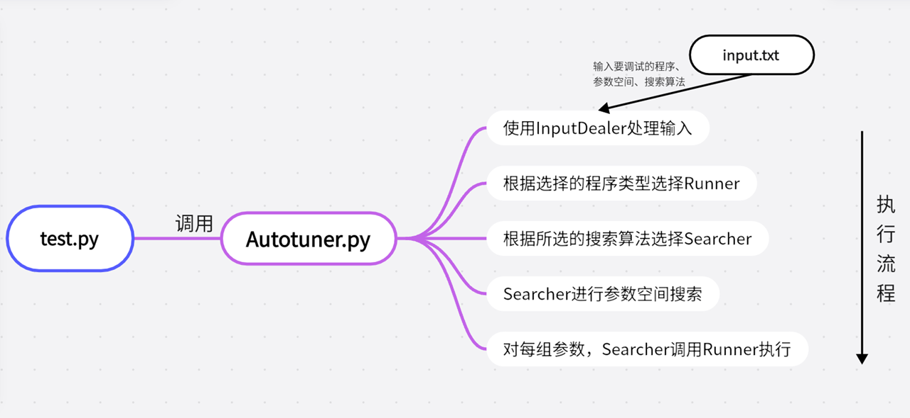
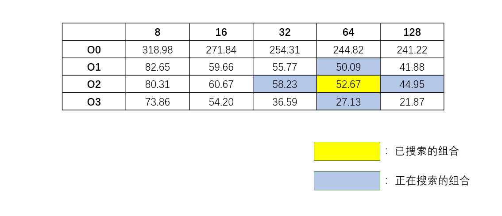
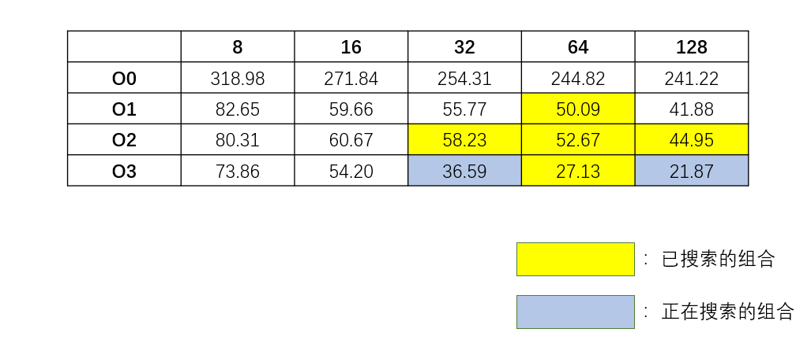
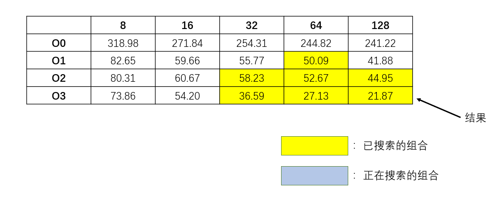
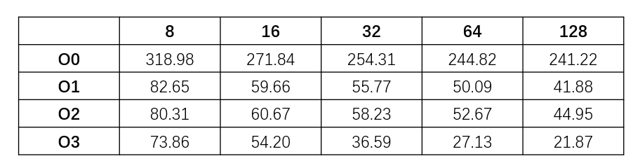

# 1. Autotuner整体结构

​		一开始尝试了[OpenTuner](https://github.com/jansel/opentuner)的使用，安装后也成功运行了示例。在了解project1的需求后，决定尝试自己实现一个Autotuner测试MatrixMultiplication.c程序的可配置参数，根据性能选择最优配置输出。

​		使用Python进行项目搭建。

		## (1) 文件树

所有项目代码结构如下：

```
.
│  Autotuner.py----------------------Autotuner主程序
│  input.txt-------------------------所有输入信息(目标程序、参数组合、参数搜索算法)
│  MatrixMultiplication.c------------被测试程序
│  test.py---------------------------执行测试程序，调用Autotuner接口
│  testCounter.txt-------------------记录test的次数，每次测试创建新的测试结果文件夹
│
├─codes------------------------------代码文件夹
│  ├─input-----------------------------输入模块
│  │      InputDealer.py-----------------处理用户的三种输入
│  │
│  ├─runners---------------------------执行模块
│  │  └─C_runner-------------------------C语言程序执行模块
│  │         C_runner.py-------------------C语言程序执行程序
│  │
│  └─search_algs-----------------------参数搜索模块
│          allAlgs.py--------------------综合处理所有搜索算法
│          GreedySearch.py---------------贪心搜索算法程序
│          GridSearch.py-----------------网格搜索算法程序
│
├─result-----------------------------测试结果文件夹
  ├─test1------------------------------测试结果1
  │  │  program.c------------------------复制过来的被测程序
  │  │  result.txt-----------------------测试结果
  │  │
  │  └─tmp-----------------------------编译产生的临时文件夹
  │          out.txt---------------------获取被测文件的输出，写入其中
  │          tmp.exe---------------------编译生成的可执行文件
  │
  └─test2
      │  program.c
      │  result.txt
      │
      └─tmp
              out.txt
              tmp.exe

```

## (2) 项目结构

​		整个测试过程的流程图如下所示：



详细流程：

1. test.py调用Autotuner.py的相关接口，执行Autotuner.test()方法开始测试。

2. Autotuner首先调用InputDealer处理用户的输入。

3. 然后根据被测程序的后缀名选择合适的Runner(.c用C_runner, .py用Py_runner, .java用Java_runner等)。

4. 再根据选择的搜索算法，调用对应的Searcher。

5. Searcher内部调用Runner，提供参数的同时获得Runner的反馈，执行其参数搜索算法。

6. 最后Searcher给出最优性能的参数组合。

   

## (3) InputDealer

整个InputDealer获取参数的详细过程如下：

```
----------------------------Autotuner----------------------------
Input the program, parameters combination and searching algorithm, 
then test the program to search the best combination of parameters.


Absolute address of program:
E:\_files\MajorLessons\软件系统优化\project\p1\project\
MatrixMultiplication.c

Please input the compiling parameters:

Parameters:
        `Type '\example' to view an example
        `Type '\end' to end input
param1 name :optimize_level
values :O0,O1,O2,O3
param2 name :\end

Please input the running parameters:

Parameters:
        `Type '\example' to view an example
        `Type '\end' to end input
param1 name :block_size
values :8,16,32,64,128
param2 name :\end

Supported algorithms:
        1. Grid Search
        2. Greedy Search
Input the number of algorithm to choose it:
1
Algorithm: Grid Search has been chosed.
Running parameters combination: {optimize_level: O0} {block_size: 8}
...

```

先后采集四种参数：

* 被测程序的绝对路径
* 编译参数空间
* 运行参数空间
* 参数搜索算法

能够处理多个编译参数和运行参数。


为方便起见，在test.py中将stdin重定向为input.txt。

input.txt:

```
E:\_files\MajorLessons\软件系统优化\project\p1\project\MatrixMultiplication.c
optimize_level
O0,O1,O2,O3
\end
block_size
8,16,32,64,128
\end
1

```


得到参数后，将其返回给Autotuner对象。

## (4) Searcher

​		用编译参数、运行参数、runner以及测试次数iters初始化Searcher。每个Searcher必须有一个search方法，作为Autotuner搜索参数组合的接口。然后所有Searcher的信息保存在allAlgs.py中，维护一个Searcher Map:

```python
from .GridSearch import GridSearch
from .GreedySearch import GreedySearch

ALGS_LIST = [
    'Grid Search',
    'Greedy Search',
]

algs_dict = {
    ALGS_LIST[0]: GridSearch,
    ALGS_LIST[1]: GreedySearch
}
```

​		Searcher.search()方法产生参数组合: 编译参数组合和运行参数组合，传给runnner运行，并从runnner获得反馈。

## (5) Runner

​		不同的Runner用以运行不同语言的程序，Runner有一个.run()方法，获取编译参数和运行参数(若该程序没有编译阶段，则编译参数为None)。

# 2. 实现的优劣

## (1) 优势

* 各个模块间耦合度低，模块与模块之间的交流基本只涉及一个接口，其余工作都在模块内部实现，这样使得代码可读性和可延展性很强。
* 结构的可扩展性很强。若要增加被测程序的类型，添加一个Runner即可；若要添加搜索算法，添加一个Searcher并加入map即可。
* 能满足多参数搜索。在InputDealer处也可看出，输入的参数可以不止一种，编译参数可以是多种，运行参数也可以是多种。
* 多次测试会生成不同的文件夹(参考了specjvm2008的result形式)，每次测试在单独的文件夹中进行，互不干扰。

## (2) 劣势

* 未使用多线程运行测试，可能会导致效率低下。opentuner是采用多线程进行测试的。
* 用户接口可能过于冗杂。但是考虑到需要输入目标程序，不得不使用这种形式。opentuner是将待测程序直接放在代码中。

# 3. Greedy Search

​		我自行设计了一种参数搜索算法，命名为“贪心搜索算法”，但在一定程度上，我更愿意叫他梯度下降搜索算法。下面展示其思想。

**Greedy Search执行的流程：**

1. 随机选取一种参数组合，并测试，得到测试时间。

2. 访问该参数组合的邻域，并对领域的每种组合进行测试。

3. 在邻域的所有测试结果中选择一个时间最短的，然后将当前参数组合改为该参数组合。

4. 重复2,3步，直到当前参数组合耗时为其邻域内耗时最短的，退出，并认为当前参数组合为最优参数组合。

名词解释：

**邻域：** 保持其他参数不变，只前后改变一种参数，并只在左右1格的范围内改变。如：当前参数组合为{optimize level: O2, block size: 16}，则其邻域为：

* optimize level: O1, block size: 16
* optimize level: O3, block size: 16
* optimize level: O2, block size: 8
* optimize level: O2, block size: 32

当然，在搜索的过程中，会检查该邻域是否访问过了。若已经访问过，则会跳过。因为当前选择的参数组合不是邻域参数组合，说明当前参数组合的运行时间要比邻域的短，所以甚至不用访问该邻域的运行时间，直接跳过即可。

用图像来解释即为：







​		这种访问邻域然后选择最优的点进入，有些类似函数空间上的梯度下降，但并不准确，因此我称其为贪心搜索算法。

# 4. Grid Search和Greedy Search的比较

## (1) 运行效率

**Grid Search:**

```
Algorithm: Grid Search has been chosed.
Running parameters combination: {optimize_level: O0} {block_size: 8}
Average time cost: 318.987372s
Running parameters combination: {optimize_level: O0} {block_size: 16} 
Average time cost: 271.838465s
Running parameters combination: {optimize_level: O0} {block_size: 32} 
Average time cost: 254.311087s
Running parameters combination: {optimize_level: O0} {block_size: 64} 
Average time cost: 244.821887s
Running parameters combination: {optimize_level: O0} {block_size: 128} 
Average time cost: 241.217270s
Running parameters combination: {optimize_level: O1} {block_size: 8} 
Average time cost: 82.647090s
Running parameters combination: {optimize_level: O1} {block_size: 16} 
Average time cost: 59.657127s
Running parameters combination: {optimize_level: O1} {block_size: 32} 
Average time cost: 55.773572s
Running parameters combination: {optimize_level: O1} {block_size: 64} 
Average time cost: 50.092287s
Running parameters combination: {optimize_level: O1} {block_size: 128} 
Average time cost: 41.875394s
Running parameters combination: {optimize_level: O2} {block_size: 8} 
Average time cost: 80.311958s
Running parameters combination: {optimize_level: O2} {block_size: 16}
Average time cost: 60.672041s
Running parameters combination: {optimize_level: O2} {block_size: 32} 
Average time cost: 58.227193s
Running parameters combination: {optimize_level: O2} {block_size: 64} 
Average time cost: 52.674716s
Running parameters combination: {optimize_level: O2} {block_size: 128} 
Average time cost: 44.953127s
Running parameters combination: {optimize_level: O3} {block_size: 8} 
Average time cost: 73.855066s
Running parameters combination: {optimize_level: O3} {block_size: 16} 
Average time cost: 54.200823s
Running parameters combination: {optimize_level: O3} {block_size: 32} 
Average time cost: 36.591904s
Running parameters combination: {optimize_level: O3} {block_size: 64} 
Average time cost: 27.134263s
Running parameters combination: {optimize_level: O3} {block_size: 128} 
Average time cost: 21.869392s

Best combination:
optimize_level: O3
block_size: 128
Average time cost: 21.869392

Total time of the experiment: 10740.233052s
```

**Greedy Search:**

```
Algorithm: Greedy Search has been chosed.
Running parameters combination: {optimize_level: O2} {block_size: 64} 
Average time cost: 57.523089s
Running parameters combination: {optimize_level: O1} {block_size: 64} 
Average time cost: 50.706293s
Running parameters combination: {optimize_level: O3} {block_size: 64} 
Average time cost: 27.557757s
Running parameters combination: {optimize_level: O2} {block_size: 32} 
Average time cost: 59.431044s
Running parameters combination: {optimize_level: O2} {block_size: 128} 
Average time cost: 48.006461s
Running parameters combination: {optimize_level: O3} {block_size: 32} 
Average time cost: 37.255367s
Running parameters combination: {optimize_level: O3} {block_size: 128} 
Average time cost: 22.398077s

Best combination:
optimize_level: O3
block_size: 128
Average time cost: 22.398077

Total time of the experiment: 1542.825604s
```

​		差异显而易见。Greedy Search的搜索空间(7种组合)较Grid Search的搜索空间(20种组合)要小很多，整体运行时间也差异很大，Grid Search的搜索时间是Greedy Search的6倍多。并且Greedy Search也成功找到了正确的最优组合。

​		Greedy Search的运行效率一定程度上取决于初始点的选择。这次运气比较好，选择的初始点离最终点比较近。若初始点选为了{O0, 8}，可能耗时会大很多，但是必然低于Grid Search。

## (2) 结果准确性

​		虽然上面的结果显示Greedy Search找到了全局最优的参数组合，但是这并不是一种必然。上面提到过，Greedy Search的搜索方法类似于梯度下降法，因此很容易陷入局部最优点。因此Greedy Search提供的结果不一定是全局最优点。Grid Search的搜索结果如下：



​		显然，{O1, 128}就是一个局部最优点，因此若初始点变化一下，最终结果就有可能陷入局部最优点，从而给出一个错误的答案。

​		而比较起来，Grid Search给出的结果是一个全局最优的，而且是必然的。

## (3) 算法改进

​		从两种算法的分析比较来看，Greedy Search可以做以下改进，一定程度上减小其进入局部最优点的概率。

* 一开始随机选取的参数组合从1个变为多个，并且要尽可能覆盖整个参数空间。然后从这些参数组合中选择最优的参数组合，以其为起点进行Greedy Search。这样能减小陷入局部最小点的概率。

* 邻域可以从$n^2$个组合变为$n^3$，其中$n$为所有参数的种类数。在上面的参数组合的情况，即邻域从上,下,左,右的4个组合变为上,下,左,右,左上,右上,左下,右下8种组合，这样虽然每次的搜索范围变大了，但是可以更快地下降到局部最优点，并且搜索范围也更全面，不易错过全局最优点。